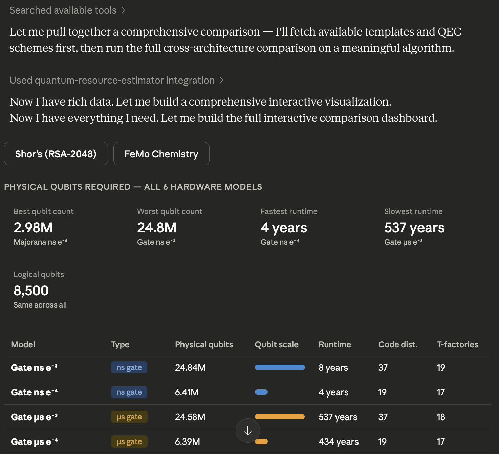

# Quantum Resource Estimator MCP Server

An MCP (Model Context Protocol) server that makes quantum resource estimation accessible through natural language. Built on [Microsoft's QDK resource estimator](https://learn.microsoft.com/en-us/azure/quantum/overview-resources-estimator).

## What It Does

Estimates physical quantum resources (qubit count, runtime) needed to run quantum algorithms on fault-tolerant hardware. Helps researchers answer questions like:

- "How many qubits does it take to break RSA-2048 with Shor's algorithm?"
- "How does a superconducting qubit hardware compare to trapped-ion for this chemistry simulation?"
- "What's the tradeoff between qubit count and runtime for my algorithm?"

## Tools

| Tool | Description |
|------|-------------|
| `estimate_resources` | Run a single resource estimation with defaults or custom params |
| `compare_configurations` | Side-by-side comparison across hardware architectures |
| `generate_frontier` | Pareto frontier: qubit-count vs. runtime tradeoff |
| `list_qubit_models` | Reference data for all 6 predefined qubit models |
| `list_qec_schemes` | Reference data for QEC schemes (surface_code, floquet_code) |
| `list_algorithm_templates` | Predefined algorithms with logical resource counts |
| `explain_parameters` | Domain-specific guidance (cryptography, chemistry, optimization) |
| `custom_qubit_model_estimate` | Estimation with fully custom qubit parameters |

## Installation

Requires [uv](https://docs.astral.sh/uv/getting-started/installation/). The `qsharp` package bundles its own native runtime — no .NET SDK install needed.

### Via PyPI (recommended)

No cloning needed. Configure your MCP client directly (see below) — `uvx` handles installation automatically on first run.

### From source

```bash
git clone https://github.com/DeDuckProject/quantum-resource-estimator-mcp
cd quantum-resource-estimator-mcp
uv sync
```

## Usage

### Configure in Claude Desktop

**macOS** — `~/Library/Application Support/Claude/claude_desktop_config.json`
**Windows** — `%APPDATA%\Claude\claude_desktop_config.json`
**Linux** — `~/.config/Claude/claude_desktop_config.json`

```json
{
  "mcpServers": {
    "quantum-resource-estimator": {
      "command": "/path/to/uvx",
      "args": [
        "--from",
        "quantum-resource-estimator-mcp",
        "qre-mcp"
      ]
    }
  }
}
```

Replace `/path/to/uvx` with the output of `which uvx`.

### Configure in Claude Code

```bash
claude mcp add quantum-resource-estimator -- /path/to/uvx --from quantum-resource-estimator-mcp qre-mcp
```

Replace `/path/to/uvx` with the output of `which uvx`.

### From source (development)

```bash
claude mcp add quantum-resource-estimator -- /path/to/uv run --directory /path/to/quantum-resource-estimator-mcp qre-mcp
```

### Inspect with MCP dev tools
```bash
uv run mcp dev src/qre_mcp/server.py
```

## Algorithm Input Methods

1. **Template** (easiest): `algorithm_template="shor_2048"` — uses predefined logical counts from published research
2. **Logical counts**: `logical_counts='{"numQubits": 100, "tCount": 200}'` — provide your own circuit counts
3. **Q# code**: `qsharp_code="..."` — provide Q# source with a parameterless entry point

## Example Queries

Via an LLM with this MCP server connected:

> "Estimate the resources to break RSA-2048 on superconducting hardware"

> "Compare all qubit technologies for the FeMo-cofactor chemistry simulation"

> "Show me the qubit vs runtime tradeoff for Shor's algorithm on trapped-ion hardware"

> "I have a circuit with 500 logical qubits and 10 million T gates — how many physical qubits do I need?"

## Example Output



## Predefined Algorithm Templates

| ID | Algorithm | Category |
|----|-----------|----------|
| `shor_2048` | Shor's factoring (RSA-2048) | Cryptography |
| `grover_aes128` | Grover search (AES-128) | Cryptography |
| `chemistry_femo` | FeMo-cofactor simulation | Chemistry |
| `qpe_generic` | Quantum phase estimation | General |

> **Note:** Templates are provided for demonstration and system exploration only. Logical counts are sourced from published research but may not capture significant details. For research-grade estimates, provide your own `logical_counts` sourced directly from primary publications. When using a template, `estimate_resources()` will include a `template_info` field in the response with the source citation and relevant caveats.

## Logs

The server runs over stdio (MCP protocol), so stdout/stderr are not available for human-readable output. Logs are written to a file you can follow in a separate terminal:

```bash
tail -F ~/.local/share/qre-mcp/qre-mcp.log
```

`-F` (capital F) handles log rotation — the file is capped at 5 MB with up to 3 backups.

To use a custom log path, set the `QRE_MCP_LOG` environment variable before starting the server.

## Running Tests

```bash
uv run pytest
```

Tests cover validators, result formatting, reference data, and parameter building. Integration tests (requiring `qsharp`) are skipped if the package is not available.
